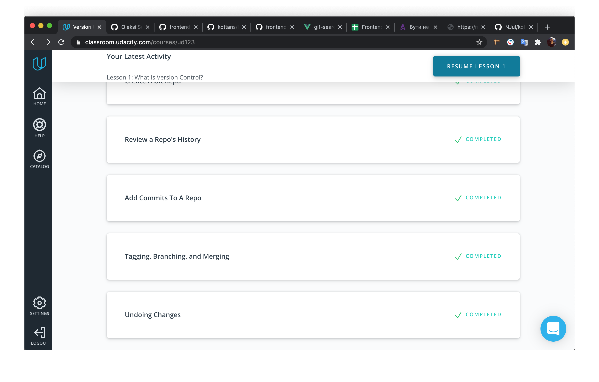

# kottans-frontend

- [x] 0 - <b>Git</b> - Done(#anchor-git)
#

### <a name="anchor-git">Git Recap</a>
I use git every day.
But I decided to take this course from 0 to refresh my knowledge.

And I made the right choice.
The main points that I learned from this course.
 - New flags for command `git log` it's:
 ```
    $ git log --oneline
    $ git log --stat
    $ git log -p
 ```
 - Command `git show`.
 - Learned for tags. Why are they needed and how to use them. `git tag -a`
 - I learned that when use `git reset --HARD`, the git stores data for another 30 days. Then need use `git reflog`.

