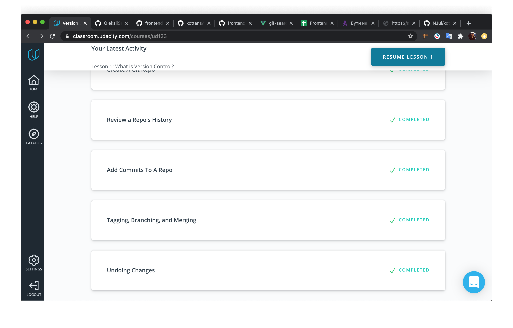
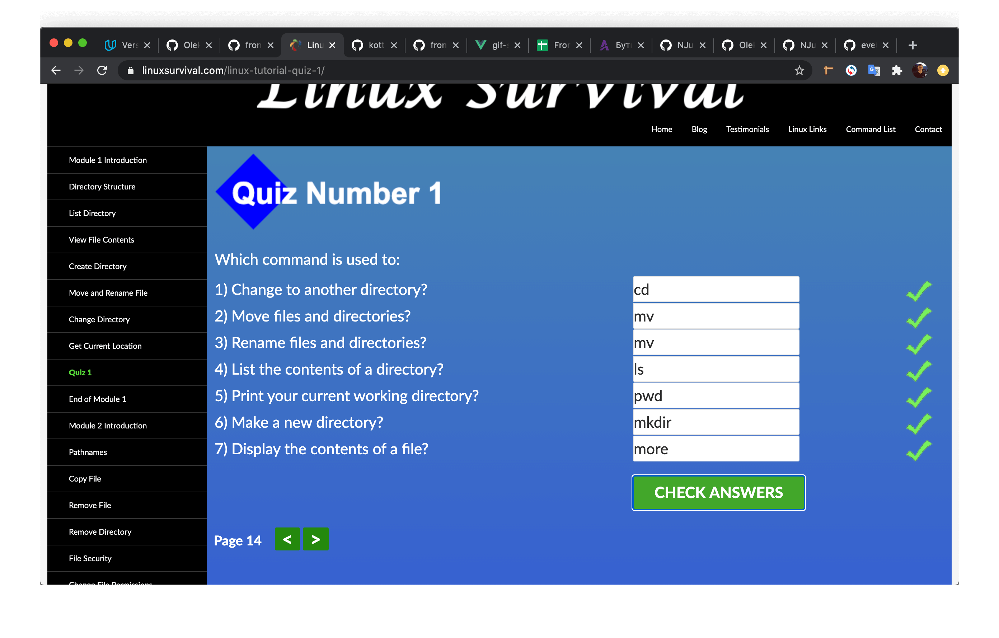
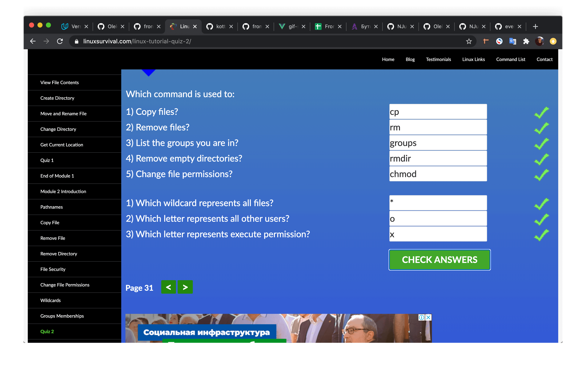
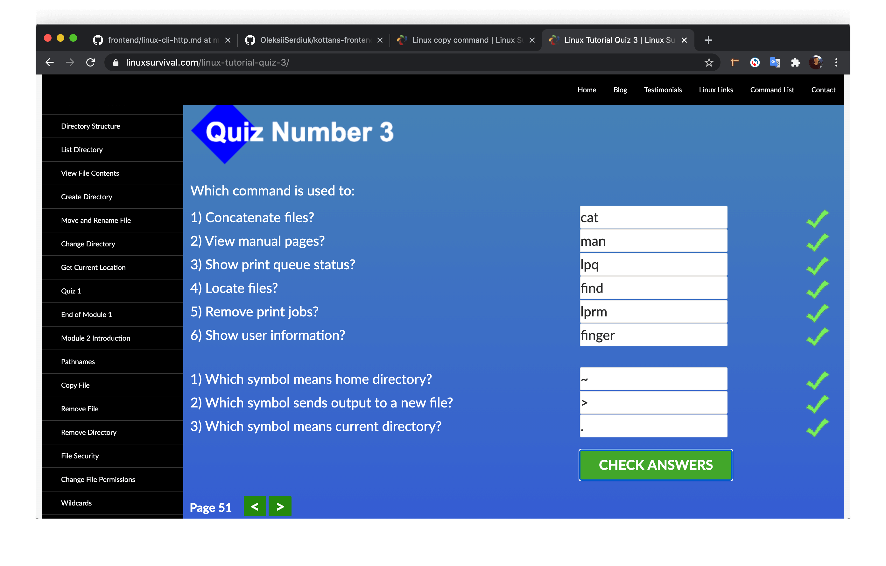

# kottans-frontend

- [x] 0 - <b>Git</b> - [Done](#anchor-git)
- [x] 1 - <b>Linux CLI, and HTTP</b> - [Done](#anchor-linux)

#

### <a name="anchor-git">Git Recap</a>
I use git every day.
But I decided to take this course from 0 to refresh my knowledge.

And I made the right choice.
The main points that I learned from this course.
 - New flags for command `git log` it's:
 ```
    $ git log --oneline
    $ git log --stat
    $ git log -p
 ```
 - Command `git show`.
 - Learned for tags. Why are they needed and how to use them. `git tag -a`
 - I learned that when use `git reset --HARD`, the git stores data for another 30 days. Then need use `git reflog`.

#

### <a name="anchor-linux">Linux CLI, and HTTP</a>



#### Linux CLI Recap
Useful information to me:
- The "more" command is used to view the contents of a file.
- Moving files
- A typical "find" command.
- And another.
#### HTTP/HTTPS
Status Codes:
- 1xx: Informational Messages
- 2xx: Successful
- 3xx: Redirection
- 4xx: Client Error (The most popular code in this class is 404 Not Found)
- 5xx: Server Error

HTTPS is a secure version of HTTP, inserting an additional layer between HTTP and TCP called TLS or SSL (Transport Layer Security or Secure Sockets Layer, respectively). 

#
